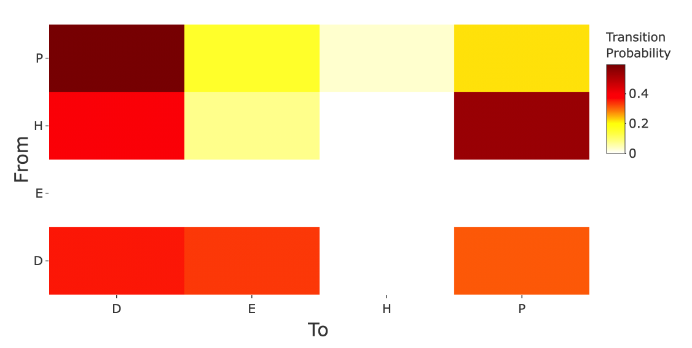
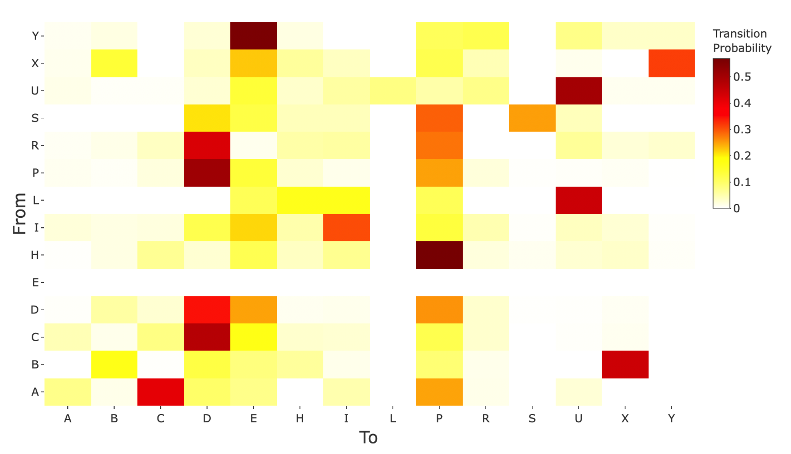
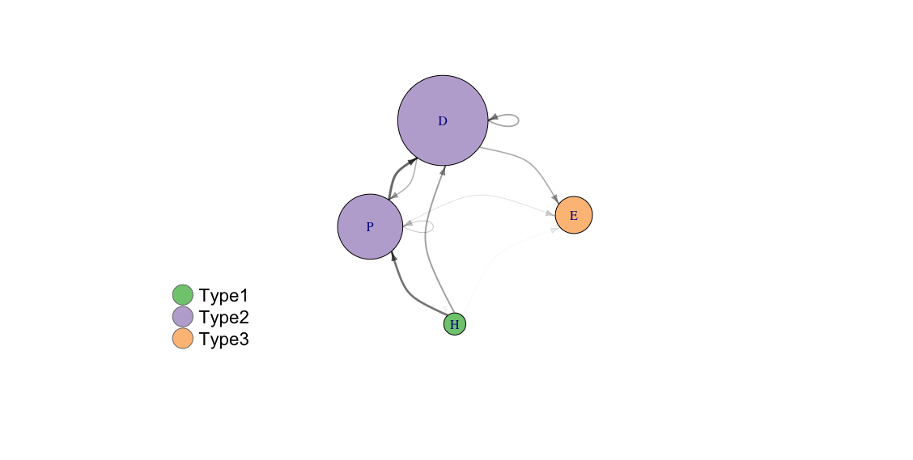
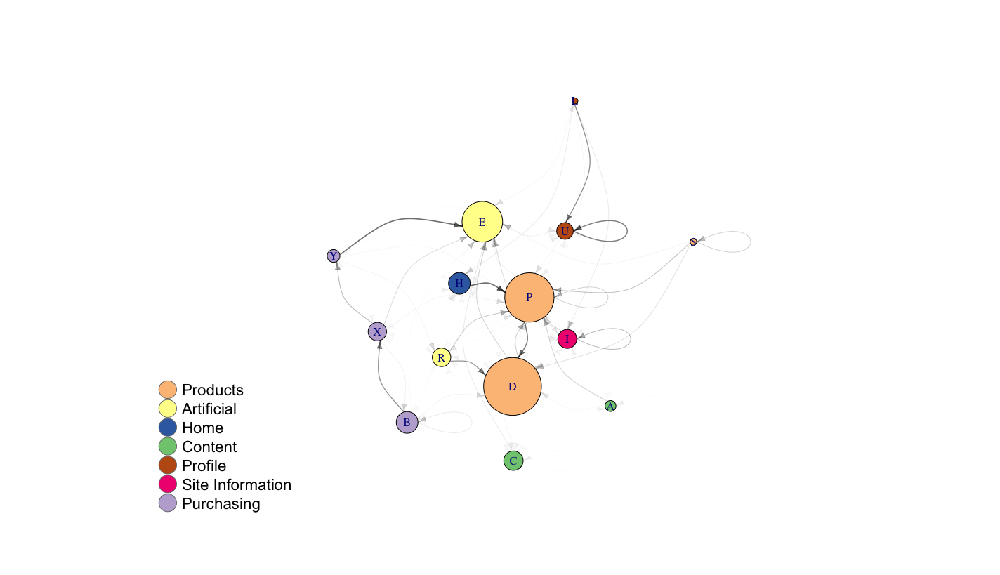

# ClickViz

<!-- badges: start -->
<!-- badges: end -->

The goal of ClickViz is to create interesting visusalitions of Markov chains using clickstream data.

## Installation

You can install the released version of ClickViz from Github with:

``` r
install_github("ryanjessop/ClickViz")
```

## Example

Examples of the heatmap visualisation of the first order Markov chain transition matrix

``` r
library(ClickViz)
plot_transition_heatmap(clickstreams)
```



``` r
plot_transition_heatmap(clickstreams_large)
```



Examples of the network visualisation of the first order Markov chain transition matrix

```r
labels <- c("Type1", "Type2", "Type2", "Type3")
state <- c("H", "P", "D", "E")
vertex_labels_example <- tibble::tibble(state=state,
                                        vertex_label=labels)
    
edges <- prepare_network_edges(clickstreams, alpha=0.01)
nodes <- prepare_network_vertices(clickstreams,
                                  vertex_labels=vertex_labels_example)
plot_transition_network(test_edges,
                        test_nodes,
                        edge_width_factor=5,
                        edge_arrow_size=0.6,
                        edge_curve_factor=0.5,
                        vertex_size_factor=1.2,
                        legend_x_position=-3.0,
                        legend_y_position=-0.5)
```



```r

labels = c("Content", "Purchasing", "Content", "Products", "Artificial",
                "Home", "Site Information", "Profile", "Products", "Artificial",
                "Products", "Profile", "Purchasing", "Purchasing")
state <- c("A", "B", "C", "D", "E", "H", "I", "L", "P", "R", "S", "U", "X", "Y")
vertex_labels_example <- tibble::tibble(state=state,
                                        vertex_label=labels)

edges <- prepare_network_edges(clickstreams_large, alpha=0.01)
nodes <- prepare_network_vertices(clickstreams_large,
                                  vertex_labels=vertex_labels_example)
plot_transition_network(edges,
                        nodes,
                        edge_width_factor=3,
                        edge_arrow_size=0.6,
                        edge_curve_factor=0.5,
                        vertex_size_factor=0.41,
                        legend_x_position=-2.0,
                        legend_y_position=-0.5)

```


